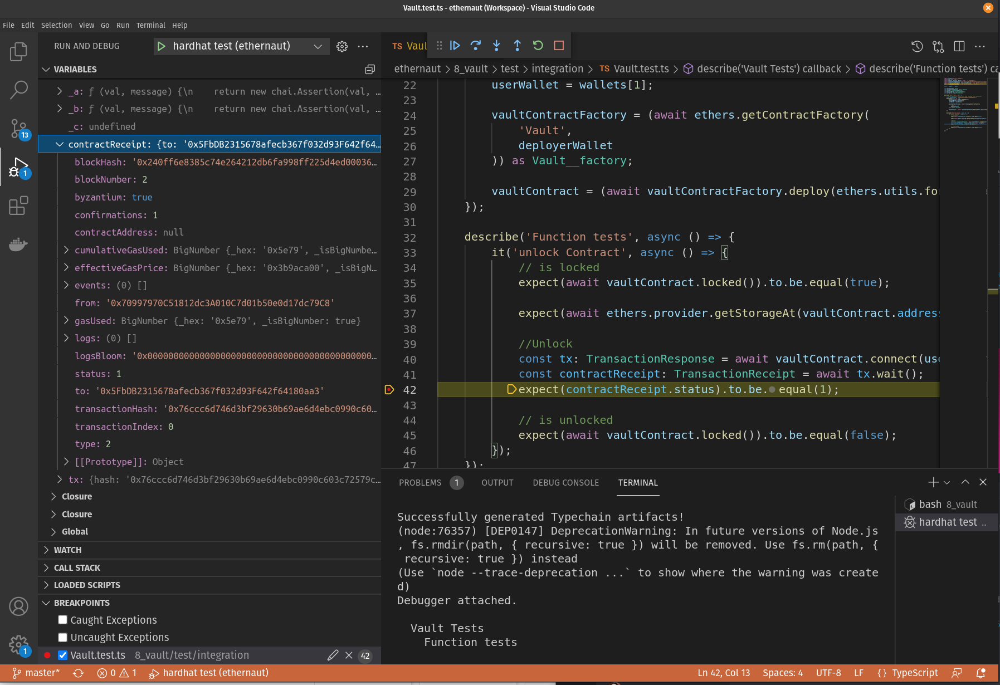

# 8 Vault

[Open Ethernaut Level 8, Connect Wallet, and Create Instance](https://ethernaut.openzeppelin.com/level/0xf94b476063B6379A3c8b6C836efB8B3e10eDe188)

## Create Environment Variables for the Level

Create `.env.contract` (listed in .gitignore).

```sh
cd 8_vault
cp .env.contract.sample .env.contract
```

## Compile

Clean and compile:

```sh
hh clean
TS_NODE_TRANSPILE_ONLY=1 hh compile
hh compile
hh test
hh coverage
```

## Deploy on Local Development Node

Start a local development node

```sh
hh node
```

Create a new terminal, go to this level's folder and run this to deploy the Vault contract:

```sh
cd 8_vault/
hh deployvault --network localhost
```

update `LOCALHOST_VAULT_CONTRACT_ADDRESS` inside `.env.contract` with address of newly deployed contract.

Claim Ownership of Vault Contract:

```sh
hh pwn --network localhost
```

## Debug test on Hardhat Network

Open `Vault.test.ts`. Set a breakpoint. Select `Run and Debug` in the side bar and run `hardhat test` from the dropdown. Debugger will stop at the breakpoint:



## Debug tasks on Localhost Network

Start a local development node

```sh
hh node
```

Open `deployvault.ts`. Set a breakpoint. Select `Run and Debug` in the side bar and run `hardhat run task`. Debugger will stop at the breakpoint.

update `LOCALHOST_VAULT_CONTRACT_ADDRESS` inside `.env.contract` with address of newly deployed contract.

Open `pwn.ts`. Set a breakpoint. Select `Run and Debug` in the side bar and run `hardhat run task`. Debugger will stop at the breakpoint.

## Deploy to Rinkeby

Note the deployed Vault contract's address from the instance deployed by Ethernaut and update `RINKEBY_VAULT_CONTRACT_ADDRESS` inside `.env.contract` with address of newly deployed contract.

Pwn the Vault Contract:

```sh
hh pwn --network rinkeby
```

## Explanation

Marking a variable as `private` in a contract won't allow other contracts to read it directly, but it doesn't keep someone from reading the variable by looking at the register.

* <https://medium.com/coinmonks/how-to-read-private-variables-in-contract-storage-with-truffle-ethernaut-lvl-8-walkthrough-b2382741da9f>

## Debugging

Debugging steps added with guidance from the video and post below:

* <https://youtu.be/6qFKK9nfX54?t=958>
* <https://github.com/nomiclabs/hardhat/issues/965>
